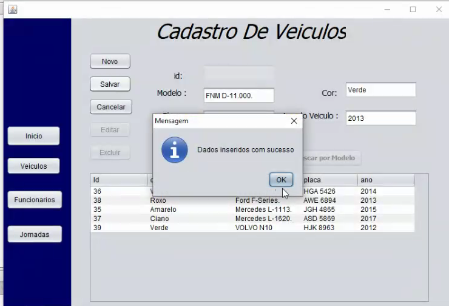
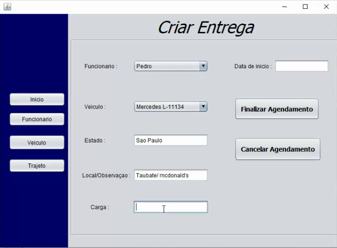
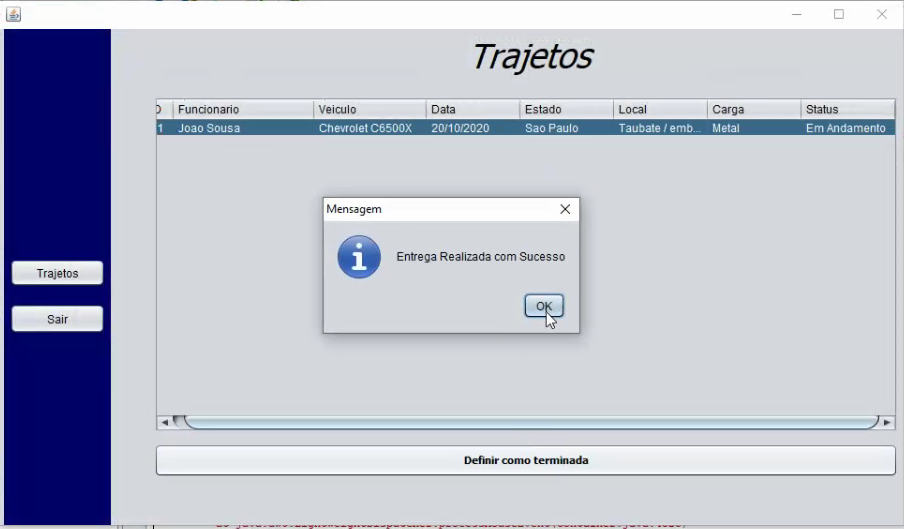

# Projeto Integrador FATECSJC 2020_2

# Objetivo
Para essa Sprint temos como objetivo o controle da viagem do motorista e resolução de algumas coisas da Sprint anterior.

# Funcionalidades
As funcionalidades dessa Sprint consistem no controle da viagem de um motorista que é feita pelo administrador e a validação (conclusão) da viagem dada pelo motorista.

# Disciplinas Integradas
- Engenharia de Softaware ( Profª. Juliana Forin Pasquini Martiniz) 
- Sistemas de Informações (Profº. Cláudio Etelvino de Lima)

# Equipe (Grupo 4)
DevTeam:
- LUCAS VINICIUS DOS SANTOS ALMEIDA
- GABRIEL FERREIRA FABIAN
- JOAO VITOR DE PAULA RODRIGUES MACHADO
- PEDRO SOUSA LOPES

Scrum Master:
- NICOLAS SOARES TELLES

Product Owner:

- MAYCON RAFAEL CRUZ SILVA

# Telas do App

# Programa Funcionando

# Diagrama de Caso de Uso
Este caso de uso serve para que um administrador cadastre,altere ou exclua um funcionário e que tambem consiga cadastrar,alterar e excluir um veículo.

- Caso de Uso

# Diagrama de Classe

# Modelagem do BD
- Modelo conceitual

- Modelo lógico

# Acesse o Product Backlog
https://github.com/nicolastelles/PI-IACIT/projects/2

# Backlog Total

US020 /SPRINT0 /27SET20
eu, enquanto gerente de projeto necessito verificar os protótipos da tela de CADASTRO de dados (CRUD JAVA) , por departamento, a fim de apresentar aos usuários para sugestões.

US021 / SPRINT0 / 27SET20
eu, enquanto gerente de projeto necessito verificar os protótipos da tela de ALTERAÇÃO de dados(CRUD JAVA) , por departamento, a fim de apresentar aos usuários para sugestões.

US022 / SPRINT0 / 27SET20
eu, enquanto gerente de projeto necessito verificar os protótipos da tela de EXCLUSÃO de dados (CRUD JAVA) , por departamento, a fim de apresentar aos usuários para sugestões.

US023 / SPRINT0 / 27SET20
eu, enquanto Product Owner necessito que seja elaborado um repositório GIT, a fim de gerenciarmos o projeto de forma colaborativa.

US024 / SPRINT0 / 27SET20
eu, enquanto gerente de projeto necessito verificar o modelo conceitual/físico do BD.

US025 / SPRINT1 / 18OUT20
Eu, enquanto Scrum Mastar necessito da criação do servidor para ser utilizada no banco de dados.

US026 /SPRINT1 /18OUT20
Eu, enquanto Scrum Master necessito da configuração do Postgres no servidor para a utilização do banco de dados.

US027 /SPRINT1 /18OUT20
Eu, enquanto Product Owner necessito que se arrume a modelagem de dados para que seja constado no projeto.

US028 /SPRINT1 /18OUT20
Eu, enquanto Scrum Master necessito da criação das tabelas para a utilização do banco de dados.

US029 /SPRINT1 /18OUT20
Eu, enquanto Scrum Master necessito da integração do SceneBuilder com o NetBeans para ocorrer o desenvolvimento das telas.

US030 /SPRINT1 /18OUT20
Eu, enquanto Scrum Master necessito da criação das telas do programa para que as mesmas sejam programadas.

US031 /SPRINT1 /18OUT20
Eu, enquanto usuário necessito que seja criado um login para que aconteça o acesso ao programa.

US032 /SPRINT1 /18OUT20
Eu, enquanto administrador necessito que seja criado um cadastro dos funcionários para que os dados sejam constados no programa.

US033 /SPRINT1 /18OUT20
Eu, enquanto usuário necessito do botão sair para sair do programa.

US034 /SPRINT1 /18OUT20
Eu, enquanto Scrum Master necessito da integração do banco de dados para ocorrer o cadastro e verificação dos dados.

US035 / SPRINT2 / 2NOV20
Eu enquanto Scrum Master necessito do diagrama de casos de usos para constar no projeto.

US036 / SPRINT2 / 2NOV20
Eu enquanto Scrum Team necessito da criação das tabelas no Postgresql para ocorrer a integração do banco de dados no projeto.

US037 / SPRINT2 / 2NOV20
Eu enquanto Scrum Team necessito da edição das tabelas no Postgresql para ocorrer a integração do banco de dados no projeto.

US038 / SPRINT2 / 2NOV20
Eu enquanto Scrum Team necessito da criação das tabelas no Postgresql para ocorrer a integração do banco de dados no projeto.

US039 / SPRINT2 / 2NOV20
Eu enquanto Scrum Team necessito da integração do java com o servidor Postgresql para ter a utilização do banco de dados no programa.

US040 / SPRINT2 / 2NOV20
Eu enquanto usuário preciso da tela do CRUD dos veículos para poder editar os veículos.

US041 / SPRINT2 / 2NOV20
Eu enquanto usuário preciso da tela do CRUD dos funcionários para poder editar os funcionários.

US042 / SPRINT2 / 3NOV20
Eu enquanto usuário preciso do cadastro dos veículos e funcionários para poder cadastrar os dados no CRUD.

US043 / SPRINT2 / 3NOV20
Eu enquanto usuário preciso da edição dos veículos e funcionários para poder editar os dados no CRUD.

US044 / SPRINT2 / 3NOV20
Eu enquanto usuário preciso da remoção dos veículos e funcionários para poder remover os dados no CRUD.

US045 / SPRINT3 / 23NOV20
Eu enquanto Scrum Team necessito atualizar o diagrama de caso de uso para constar no projeto.

US046 / SPRINT3 / 23NOV20
Eu enquanto Scrum Team necessito atualizar o diagrama de classes para constar no projeto.

US047 / SPRINT3 / 24NOV20
Eu enquanto Scrum Team necessito atualizar o visual do aplicativo para uma melhor visualização.

US048 / SPRINT3 / 24NOV20
Eu enquanto Scrum Master necessito da aplicação da chave estrangeira para ocorrer a manipulação de dados.

US049 / SPRINT3 / 25NOV20
Eu enquanto administrador necessito da criação das entregas para ocorrer as viagens dos motoristas.

US050 / SPRINT3 / 25NOV20
Eu enquanto administrador necessito da edição das entregas para administrar as viagens dos motoristas.

US051 / SPRINT3 / 25NOV20
Eu enquanto motorista necessito exibir a conclusão das entregas para constar no sistema.
