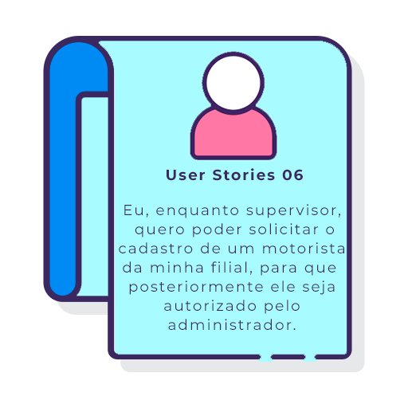
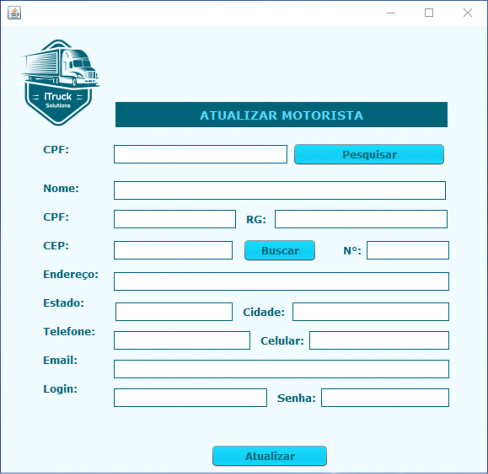
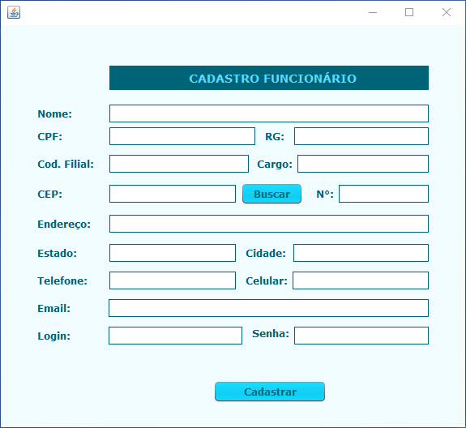
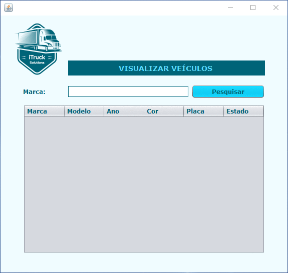
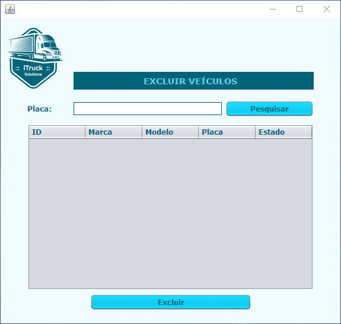
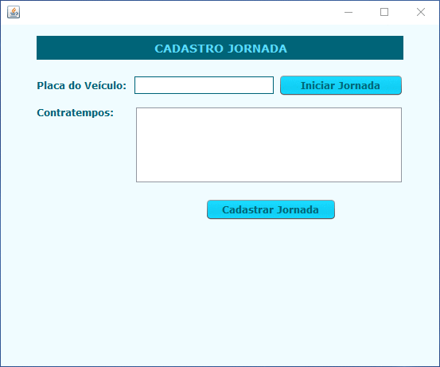

<body>
    <nav>
        

        

        
<h1>iTruck :articulated_lorry:</h1>

        
Seja bem vindo ao repositório do iTruck!

        
<h2>Índice</h2>

        <ul>
            <li><a href="#proposta">A proposta do projeto</a></li>
            <li><a href="#sobre-itruck">O que é o iTruck?</a></li>
            <li><a href="#disciplinas">Displinas Envolvidas</a></li>
            <li><a href="#integrantes">Integrantes da equipe</a></li>
            <li><a href="#etapas">Etapas de desenvolvimento</a></li>
            <li><a href="#funcionalidades">Funcionalidades</a></li>
            <li><a href="#tecnologias">Tecnologias utilizadas</a></li>
            <li><a href="#cards">Cards das Sprints do sistema</a></li>
            <li><a href="#user_story">User Stories</a></li>
            <li><a href="#wireframes">Wireframes do iTruck</a></li>
            <li><a href="#documentacao">Documentação</a></li>
        </ul>
    </nav>
        <section>
            
<h2 id="proposta">A proposta do projeto :scroll:</h2>

            
Projeto Integrador é um projeto no qual nós alunos trabalhamos em conjunto com um cliente. Neste ano, o cliente é a empresa IACIT. Nos foi solicitado um sistema para o gerenciamento e controle da jornada de trabalho de motoristas que seja parametrizável visando à disponibilização de funcionalidades de planejamento, acompanhamento, controlando a jornada de trabalho de cada um desses colaboradores. Nosso sistema deverá oferecer um cadastro de funcionário de vários níveis de acesso, um cadastro para os dados do veículo, um cadastro para dados de filiais, um cadastro para dados de região e um cadastro para dados da jornada dos motorista. 

            
<a href="#topo">Voltar ao Topo</a>

        </section>
        <section>
            
<h2 id="sobre-itruck">Sobre o iTruck :truck:</h2>

            
O iTruck foi idealizado pelos integrantes seguindo um padrão de nomes do projeto integrador do semestre passado, o qual fizemos o <a href="https://github.com/MatheusCoxxxta/ipet-app">iPet</a>. Mesmo sem todos os integrantes, achamos a idéia genial e decidimos levar adiante. Hoje com equipe reduzida, buscamos performar da melhor maneira possível e entregar resultados de qualidade para nosso cliente IACIT.

            
<a href="#topo">Voltar ao Topo</a>

        </section>
        <section>
<h2 id="disciplinas">Disciplinas Envolvidas :ghost:</h2>

            

            

            

            
<a href="#topo">Voltar ao Topo</a>

        </section>
        <section>
            
<h2 id="integrantes">Integrantes da Equipe :dancers:</h2>

            

            

            

            
<a href="#topo">Voltar ao Topo</a>

        </section>
        <section>
            
<h2 id="etapas">Etapas de Desenvolvimento :computer: </h1>

            
Para desenvolvimento do projeto, utilizamos a metodologia scrum, que consiste em dividir o projeto em etapas chamadas sprints. Cada sprint varia sua duração entre 2 e 3 semanas e durante cada sprint são feitas reuniões semanais de verificação de andamento do projeto. Ao final de cada sprint, nós mostramos o andamento do projeto ao cliente. Essa metodologia foi escolhida por sua facilidade de implementação e pelo fato de que ao dividir, caso o cliente queira uma modificação, nós não precisamos mexer no projeto como um todo.  <h4>Branches de cada entrega:</h4>

    <table>
              <thead>
                     <th width=100px>Entregas</th>
                     <th>Descrições</th>
                     <th width=215px>Datas</th>
                     <th>Links</th>
              </thead>
              <tbody>
                     <tr>
                         <td>Sprint 00</td>
                            <td>Entrega de Documentação: wireframes, backlog, planejamento de entrevista, modelo conceitual e lógico do banco de dados e User Stories</td>
                            <td>07/09/2020 a 27/09/2020</td>
                            <td><a href="https://github.com/thaisrabelo/iTruck/tree/sprint00">Visualizar</td>
                     </tr>
                     <tr>
                            <td>Sprint 01</td>
                            <td>Cadastro Veículo, Cadastro Filial, Cadastro Região e Cadastro Funcionário.</td>
                            <td>28/09/2020 a 18/10/2020</td>
                            <td><a href="https://github.com/thaisrabelo/iTruck/tree/sprint01">Visualizar</td>
                     </tr>
                     <tr>
                            <td>Sprint 02</td>
                            <td> Consulta Funcionário. Alterar Funcionário, Excluir Funcionário, Consulta Veículo, Alterar Veiculo e Excluir Veículo</td>
                            <td>19/10/2020 a 08/11/2020</td>
                            <td><a href="https://github.com/thaisrabelo/iTruck/tree/sprint02">Visualizar</a></td>
                     </tr>
                      <tr>
                            <td>Sprint 03</td>
                            <td>Relatórios do Sistema e Auditoria.</td>
                            <td>09/11/2020 a 29/11/2020</td>
                            <td><a href="https://github.com/thaisrabelo/iTruck/tree/sprint03">Visualizar</a></td>
                     </tr>
              </tbody>
       </table>
    
<a href="#topo">Voltar ao Topo</a>

        </section>
        <section>
            
<h2 id="funcionalidades">Funcionalidades :wrench: </h2>

            
      

            
      

            
      

            
      

            
      

             
<a href="#topo">Voltar ao Topo</a>

        </section>
        <section>
            
<h2 id="tecnologias">Tecnologias :rocket: </h2>

            
   

            
   

            
<a href="#topo">Voltar ao Topo</a>

            </section>
            <section>
            
<h2 id="cards">Cards das Sprints :bookmark: </h2>

            
<h3>Sprint 00</h3>

            
Para essa Sprint ficou acordado com o cliente a entrega da prototipação e documentação do projeto, incluindo modelagem conceitual e física do banco de dados, backlog com priorização de funcionalidade e as user stories. Toda a documentação pode ser acessada ao final do README.

            

             
<a href="#topo">Voltar ao Topo</a>

            
<h3>Sprint 01</h3>

            
Conforme o cliente solicitou, nessa sprint o foco foi a entrega de cadastro de funcionários, veículos, filiais e região. Uma vez que o sistema irá girár em torno dos funcionários e suas jornadas de trabalho, essa entrega se torna de extrema importancia pois envolve o cadastro de peças chave do sistema.

            

             
<a href="#topo">Voltar ao Topo</a>

            
<h3>Sprint 02</h3>

            
Para essa sprint foi solicitado o CRUD completo de funcionários e Veículos, funcionalidades essas que, uma vez pronta, podem auxiliar na programação das demais, tendo em vista que são os CRUDs chave do sistema.

            

            
<a href="#topo">Voltar ao Topo</a>

            </section>
            <section>
            
<h2 id="user_story"> User Stories :runner: </h2>

            
<h3></h3>

            

            
            
            
            
            
            
            

            
<a href="#topo">Voltar ao Topo</a>

            
<h3> </h3>

            

            
            
            
            
            
            
            
            
            
            
            
            
            
            
            
            
            
            
            
            
            
            

            
<a href="#topo">Voltar ao Topo</a>

            </section>
            <section>
            
<h2 id="wireframes">Wireframes do iTruck :city_sunrise::city_sunset:</h2>

            
<h3>CRUD Motorista</h3>

            

            

            

            

            
<h3>CRUD Funcionários</h3>

             

            

            

            

            
<h3>CRUD Veiculos</h3>

             

            

            

            

            
<h3>Jornada</h3>

             

             
<h3>Relatório</h3>

             

             
<h3>Auditoria</h3>

             

            
<a href="#topo">Voltar ao Topo</a>

            </section>
            <section>
            
<h2 id="documentacao">Documentação :open_file_folder:</h2>

              
<a href="https://github.com/thaisrabelo/iTruck/tree/main/documentacao">Documentação</a>

            
<a href="#topo">Voltar ao Topo</a>

            </section>
</body>

