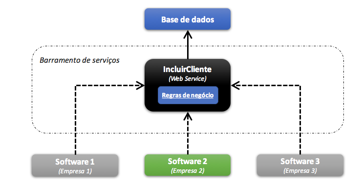
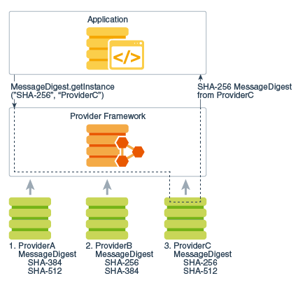
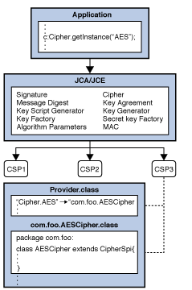

# Projeto Segurança da informação

## Integrantes da equipe
- Ariana Rodrigues Cursino [github](https://github.com/arcursino) / [linkedin](https://www.linkedin.com/in/arcursino/) 
- Felipe Augusto Carolino [github](https://github.com/felipecarolino) / [linkedin](https://www.linkedin.com/in/felipe-carolino)
- Gilherme De Polli Migliano [github]( https://github.com/guilhermemigliano) / [linkedin](https://www.linkedin.com/in/guilhermemigliano)
- Matheus da Cruz Oliveira dos Santos [github](https://github.com/matheuscosantos) / [linkedin](https://www.linkedin.com/in/matheuscosantos/)
- Rodrigo Marcelino Silva Amorim [github](https://github.com/RodrigoMarcelin) / [linkedin](https://www.linkedin.com/in/rodrigo-marcelino-a5578ab8)

### Projeto safe_share
Usaremos como prova de conceito: 
- Criação de banco de dados para uma loja de departamentos.
- Alteração no banco de dados para atender a geração de relatórios e ofuscação dos dados.
- Criação de uma interface via API Rest para que o usuário possa fazer o pedido das mudanças.

## Problema
O problema que iremos tratar nesse projeto, é sobre compartilhamento de dados pessoais.

## Objetivo
Aplicação do artigo 9º, da lei LGPD no Back-end.
Com isso iremos trabalhar com:
- Ofuscar dados pessoais, para que dados de vendas sejam fornecidos de forma estatística, assim não tornando o portador do dado identificável.
- Criar regra de negócio, para que caso haja uma solicitação de dados pessoais, o titular do dado tenha que ser consultado para autorização.
- Criar uma aplicação Front-end, onde o titular do dado tenha acesso direto ao histórico de compartilhamento, saiba a finalidade específica do tratamento, tenha acesso a pessoa responsável pelo controle de dados, e de forma clara consiga autorizar ou negar a utilização deles quando solicitado.

Para mais informações sobre a lei e tópicos deste trabalho, acessar o arquivo [Info.md :book:](Info.md) 

## Desenvolvimento
**Para alcançar o objetivo, foram utilizadas as seguintes estruturas:**

Dado o contexto acima, desenvolveremos uma aplicação com um CRUD com acesso a Bancos de dados voltada a resolver problemas de anonimização de uma aplicação de vendas online fictícia, onde o compartilhamento de dados pessoais, só aconteça com prévia autorização do titular, isso por solicitação de compartilhamento, deixando claro os fins para tratamento desses dados. 

Para isto contaremos com a seguinte estrutura:

- Estrutura do Sistema:

**Técnicas utilizadas para Criptografar**
Dada a resolução do problema, decidimos implementar um algoritmo  de criptografia simétrica simples que resolve a questão do armazenamento seguro de informações pessoais de forma anonimizada. Ao se cadastrar no site, para cada usuário é criada uma chave simétrica simples e é armazenada dentro de um banco de dados de chaves criptografadas, separado do banco de dados pessoais.

- Arquitetura Criptografia Java - JCA

O JCA é uma peça importante da plataforma e contém uma arquitetura de "provedor" e um conjunto de APIs para assinaturas digitais, resumos de mensagem (hashes), certificados e validação de certificado, criptografia (cifras de bloco / fluxo simétrico / assimétrico), geração de chave e gerenciamento e geração segura de números aleatórios, para citar alguns. Essas APIs permitem que os desenvolvedores integrem facilmente a segurança ao código do aplicativo. A arquitetura foi projetada em torno dos seguintes princípios:

1. Independência de implementação: os aplicativos não precisam implementar algoritmos de segurança. Em vez disso, eles podem solicitar serviços de segurança da plataforma Java. 

2. Interoperabilidade de implementação: os provedores são interoperáveis ​​entre aplicativos. Especificamente, um aplicativo não está vinculado a um provedor específico e um provedor não está vinculado a um aplicativo específico.

3. Extensibilidade do algoritmo: a plataforma Java inclui vários provedores integrados que implementam um conjunto básico de serviços de segurança amplamente usados ​​atualmente.

**Arquitetura dos Provedores**

Provedor específico solicitado         |  Descrição de exemplo de como o aplicativo recupera a instância da cifra "AES"
:-------------------------------------:|:------------------------------:
     |  

Para o projeto, utilizaremos a criptografia do padrão [AES](https://nvlpubs.nist.gov/nistpubs/FIPS/NIST.FIPS.197.pdf) (Advanced Encryption System), utilizando uma senha com um tamanho de 256 bits e o método de criptografia em bloco no modelo [CBC](https://csrc.nist.gov/publications/detail/sp/800-38a/final) (Cypher Block Chaining).

Para mais especificações da [JCA](https://docs.oracle.com/javase/8/docs/technotes/guides/security/crypto/CryptoSpec.html) 

## Deploy da API

A API pode ser acessada pelo site: https://safe-share-si.herokuapp.com/swagger-ui.html#/

## Backlog

O Backlog abaixo demonstra os processos que realizaremos para a criação deste projeto:

### Sprint 1
- Organização do github. :heavy_check_mark:
- Criação do burndown (é uma representação gráfica do trabalho a ser feito versus tempo). :heavy_check_mark:
- Criação do README.md :heavy_check_mark:

### Sprint 2 - [Entrega2](entrega2.md)
- Estrutura do Banco de Dados da aplicação. :heavy_check_mark:  
       
- Back-end inicial para simulação de dados. :heavy_check_mark:      

### Sprint 3 - [Entrega 3](entrega3.md)
- Implementação de criptografia de dados, com a finalidade de ofuscar dados pessoais. :heavy_check_mark:
- Implementar regra de compartilhamento visando dados estatística (dados sem link com o titular). :heavy_check_mark:

### Sprint 4 - [Entrega 4](entrega4.md)
- Implementação de uma regra de negócio, onde o compartilhamento de dados pessoais, só aconteça com prévia autorização do titular, isso por solicitação de compartilhamento, deixando claro os fins para tratamento desses dados. :heavy_check_mark:

### Sprint 5 - [Entrega 5](entrega5.md)
- Desenvolvimento do Frontend :heavy_check_mark:
- Inicio implementação do Frontend com o Back-end da aplicação :heavy_check_mark:

### Sprint 6 - [Entrega 6](entrega6.md)
- Término da implementação Front-end :heavy_check_mark:
- Criação de uma apresentação para o trabalho :heavy_check_mark:

### Links

- [Readme Backend](https://github.com/RodrigoMarcelin/safe_share/blob/master/backend/README.md)
- [Readme Frontend](https://github.com/RodrigoMarcelin/safe_share/blob/master/frontend/README.md)
- [Readme BD](https://github.com/RodrigoMarcelin/safe_share/blob/master/bd/README.md) 
- A Apresentação final do projeto Safe-Share na Feira de Soluções da Fatec pode ser visto no youtube: https://youtu.be/mFeVwI7-ROY

