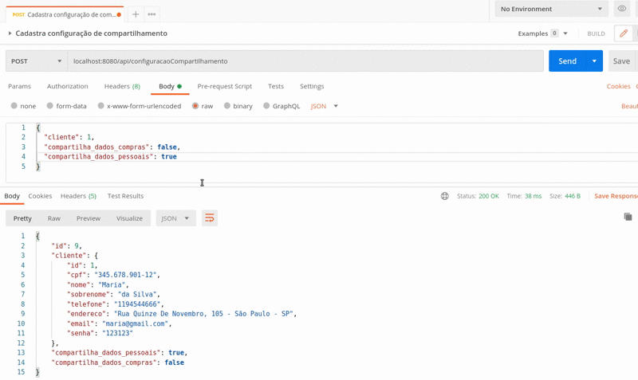

# O Back-End contou com as seguintes tecnologias:

* O projeto foi iniciado com Spring Boot, com os módulos de persistência JPA (para persistir objetos Java), Lombok(biblioteca Java focada em produtividade e redução de código). E o compilador Maven. Mais detalhes da configuração inicial do projeto pode ser vista em [Pom](backend/pom.xml).
* Criação das entidades bem como os endpoints.
* Adição do projeto no Swagger (que é um framework para descrição, consumo e visualização de serviços RESTful, bem como a documentação da implementação).
* Deploy da [API](https://safe-share-si.herokuapp.com/swagger-ui.html#/). 


## Configurando o ambiente Java no Ubuntu
Abaixo estão as informações para configurar o ambiente Java.
### Instalando o Java
```
sudo apt install openjdk-11-jdk
sudo apt install openjdk-11-jre
```

### Verificando a versão do Java
```
java -version
```

### Verificando e alterando a versão do Java instalado
```
sudo update-alternatives --config java
```

### Adicionando a variável de ambiente JAVA_HOME
```
sudo nano /etc/environment
```
Ao abrir o editor Nano, adicione ao final do arquivo a seguinte linha:

```
JAVA_HOME="/usr/lib/jvm/java-11-openjdk-amd64/bin/"
```

Reinicie o terminal e digite:
```
echo $JAVA_HOME
```
Caso a saída seja "/"usr/lib/jvm/java-11-openjdk-amd64/bin/" a instalação foi feita corretamente.

## Iniciando o projeto em Spring Boot
Entre em https://start.spring.io/ para criar um projeto com as seguintes configurações: 


Abra o IntelliJ e adicione o plugin Lombok para redução de boilerplate


## Camadas do projeto
### Model
É a camada para adição das entidades da aplicação.
### Repository
É a camada que implementa o JPA para persistência dos dados no banco.
### Resource
É a camada para exposições das URL's da API.
### Árvore de diretórios


## Banco de dados
Para executar a aplicação é necessário criar um banco de dados chamado **safeshare**

### Implementação Back-end
