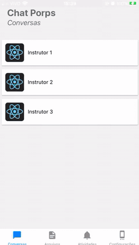

# Entrega 3 (18/10)

Nesta Sprint o foco foi no desenvolvimento da tela de atividades,arquivos no aplicativo. No web o foco foi o desenvolvimento do componente de selecionar Pessoas. Houve também atualização na tela de chat e adição da tela de login. No back end houve mapeamente de novas entidades e atualização de alguns endpoints para tratamento de erros. 
Todos as implementações dessa sprint estão disponiveis na branch **Sprint3**

## Backend

- Inclusão Autenticação por JWT
- Mapeamento entidade Atividade
- Mapeamento entidade Arquivo
- Atualização endpoint POST /mensagem
- Atualização endpoint PUT /mensagem
- Atualização endpoint POST /conversa

## Front end

- Componente de selecionar Pessoas
- Atualização tela de chat

## App

- Adição tela de arquivos
- Adição tela de Atividades

## Documentos

- [CheckList](https://drive.google.com/file/d/1f1VaF3AyBDdZfDbSbJjDIOPtw1ggvbHM/view?usp=sharing)
- [Planejado X Realizado(tempo & custo)](https://drive.google.com/file/d/14-lm5uqeSYihOUIuX0v5wkQlHiZiVkDw/view?usp=sharing)
- [Raci](https://drive.google.com/file/d/1Qx8TeUGp_zHq9GyykTacjRljqdOhNFAq/view?usp=sharing)
- [Matriz Comunicação](https://drive.google.com/file/d/17wN9k7ovAQHJzKbErLM1wc1aZUbPGm6w/view?usp=sharing)
- [Portfólio de serviço](https://drive.google.com/file/d/1XlE7-h5xuJhxYkxVZT1x1KfPpBq5v-Z7/view?usp=sharing)

## Gifs
### Tela de atividades

### App

## Próximos passos

- Consumo de API p autenticação
- Adição de libs para gerenciamento de estado(Vuex)
- Estudos sobre implementação de I.A
- Estudos sobre chats flutuantes

## Ferramentas Utilizadas

- Java
- Sprint Boot
- Maven
- Junit
- Vue
- Vue Router
- Vuetify
- React native
- Expo