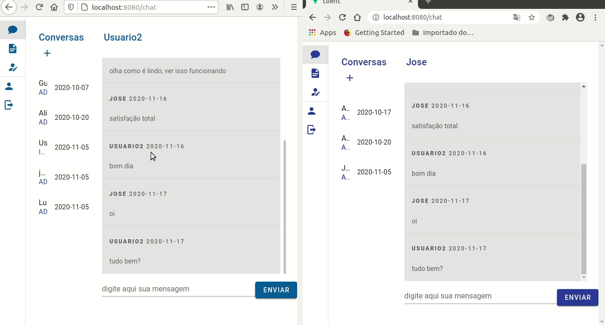

# Entrega 5 (15/11)

Nesta Sprint o foco foi no adição da feature de fechar atividades e visualização de atividade fechadas.
Além disso trabalhou-se na adição de websocket e chat flutuante.

**Todas as implementações dessa sprint estão disponiveis na branch Sprint5**

## Backend
- Adição de rota get pegar atividades fechadas
- Adição de rota get pegar atividades abertas
- Atualização da entidade Atividades. Adição de campos (data_prevista, data_fechada, ehAberto)
- Implementação de websocket com "spring-boot-starter-websocket"

## Front end

- Tela para visualizar atividades fechadas
    - construção de interface
    - consumo de rota
- Atualização de tela criar atividades
    - Adição opção para selecionar a data de fechamento
- Atualização de rota consumida em atividades
    - Pegando apenas atividades abertas
- Implementação de webocket com "webStompClient"

## App

- Atualização de usabilidade
- Atualização em algumas telas

## Documentos
- <a href="https://drive.google.com/file/d/14-lm5uqeSYihOUIuX0v5wkQlHiZiVkDw/view?usp=sharing" target="_blank"> Planejado X Realizado(tempo & custo) </a>
- <a href="https://drive.google.com/file/d/1Pwnfpijwba-FQIs3GR5skLhvJ3ObRUFm/view?usp=sharing" target="_blank">Matriz RACI</a>
- <a href="https://drive.google.com/file/d/13vXsM7JfC-tg6th4iq_VNZbcAQk7QHAe/view?usp=sharing" target="_blank">Plano de risco</a>
- <a href="https://drive.google.com/file/d/1g205YSD0Imq9qVSnm-6lG_pJmlDWViPe/view?usp=sharing" target="_blank">CheckList</a>
- <a href="https://drive.google.com/file/d/1_JQZmI6vEjd37IH7-pZOcCbaz9RsnEtg/view?usp=sharing" target="_blank">Framework de suporte (FreshDesk)</a>
- <a href="https://drive.google.com/file/d/1bcEUNFTy4GAE6sQNo2clR5lc_sz7zB3Q/view?usp=sharing" target="_blank">Gerenciamento de aquisições</a>
- <a href="https://drive.google.com/file/d/1LXLpHs2u3Ke7N87W6Z-Y4C91l8s889pH/view?usp=sharing" target="_blank">Project model canvas</a>

## Gifs
### Aplicação web
#### tela de chat com websocket

#### tela de atividades

#### chat flutuante

## Próximos passos

- Implementação de sessão websocket
- Finalização Chat flutuante
- Finalização IA

## Ferramentas Utilizadas

- Java
- Sprint Boot
- Maven
- Junit
- Vue
- Vue Router
- Vuetify
- React native
- Expo