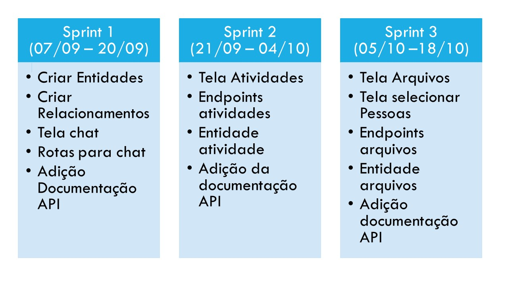
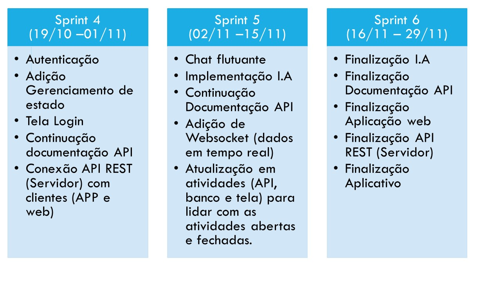

# pi-chat

Esse projeto é resultado de um trabalho acadêmico realizar na Faculdade de tecnologia de São José dos Campos - Professor Jassen Vidal. 

## Requisitos 

Os requisitos do trabalho estão dividos em requisitos funcionais, descrevem funcionalidades do trabalho, e requisitos não funcionais descrevem requisitos como: tecnologia a ser utilizada, arquitetura, ambiente, etc. 

### Requisitos funcionais
* Interface Flutuante.
* Interface Interna.
* Campo de pesquisa de alunos, colaboradores, chats, atividades.
* Integrar com o BD de usuários criados para alimentação de contatos.

### Requisitos não funcionais
* Linguagem Java
* Banco de Dados Relacional
* Documentações

## Solução proposta
* Chat com diferentes níveis de usuários
* Lista de transmissão para envio de mensagens em massa
* Controle de atividades por meio de notas
* Manutenção de arquivos
* Api para integração com outros sistemas
* Aplicativo para praticidade dos usuários

## Plano de Ação

## Relatório de Entregas

- [Relatorio Sprint 1](https://github.com/LASalvador/pi-chat/blob/master/relatorios-sprint/sprint1.md#entrega-1-2009)
- [Relatorio Sprint 2](https://github.com/LASalvador/pi-chat/blob/master/relatorios-sprint/sprint2.md#entrega-2-0410)
- [Relatorio Sprint 3](https://github.com/LASalvador/pi-chat/blob/master/relatorios-sprint/sprint3.md#entrega-3-1810)
- [Relatorio Sprint 4](https://github.com/LASalvador/pi-chat/blob/master/relatorios-sprint/sprint4.md#entrega-4-0111)
- [Relatorio Sprint 5](https://github.com/LASalvador/pi-chat/blob/master/relatorios-sprint/sprint5.md#entrega-5-1511)

## Tecnologias Utilizadas
* [Vue js](https://vuejs.org/)
* [Vue-router](https://router.vuejs.org/)
* [Vuex](https://vuex.vuejs.org/)
* [Java](https://www.java.com/pt_BR/)
* [Spring Boot](https://spring.io/projects/spring-boot)
* [Maven](https://maven.apache.org/)
* [Mysql](https://www.mysql.com/)

## Integrantes do grupo 

Nome | Github | Linkedin
------------ | ------------- | -----------
Aline Lima de Paula| [Acessar Github](https://github.com/alineelima) | [Acessar Linkedin](https://www.linkedin.com/in/aline-lima-de-paula/)
Gabriel de Brito Carvalho | [Acessar Github](https://github.com/gamebielo) | [Acessar Linkedin](https://www.linkedin.com/in/gabriel-carvalho-b937a5160)
João Vitor Almeida Arruda | [Acessar Github](https://github.com/jeyarruda) | [Acessar Linkedin](https://www.linkedin.com/in/jo%C3%A3o-vitor-almeida-arruda-233612154/)
Guilherme Rodrigo Santos Cursino | [Acessar Github](https://github.com/grcursino) | [Acessar Linkedin](https://www.linkedin.com/in/guilherme-cursino-ba1476164/)
Monica Nathalia Sousa Torres | [Acessar Github](https://github.com/monica261) | [Acessar Linkedin](https://www.linkedin.com/in/m%C3%B4nica-torres-198875149)
Lucas Ribeiro Sonnewend Cardoso | [Acessar Github](https://github.com/lrsonnewend) | [Acessar Linkedin](https://www.linkedin.com/in/lucas-sonnewend-a87a66180/)
Mayara Brígida Medeiros da Silva | [Acessar Github](https://github.com/mayaramedeiros) | [Acessar Linkedin](https://www.linkedin.com/in/mayara-br%C3%ADgida-398733182/)
Lucas Almeida Salvador | [Acessar Github](https://github.com/lasalvador) | [Acessar Linkedin](https://www.linkedin.com/in/lassalvador/)
Paulo Henrique da Silva Correia | [Acessar Github](https://github.com/paulohenrique7010) | [Acessar Linkedin](https://www.linkedin.com/in/paulo-henrique-36355316b/)

