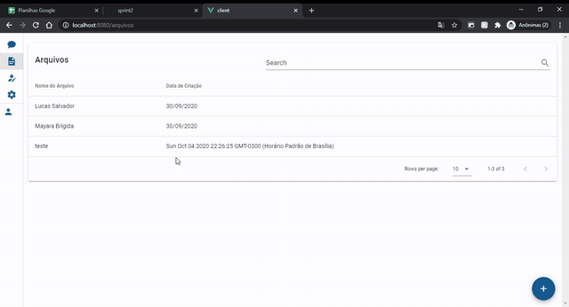
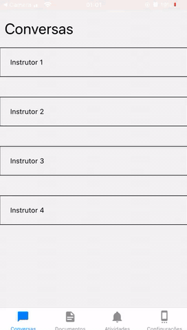

# Entrega 2 (04/10)

Nesta Sprint o foco foi no desenvolvimento da tela de atividades,arquivos. Iniciou-se também os trabalhos do app
Todos as implementações dessa sprint estão disponiveis na branch **Sprint2**

## Backend

- Rotas para listar todas as mensagem de uma conversa
- Rota para criação de mensagem
- Rota para listas as conversas de um usuários
- Adicionar h2 como banco de teste
- Implementação do swagger

## Front end

- Adição de axios
- Adição tela de atividades
- Adição tela de arquivos

## App

- Tela com lista de Conversas
- Tela chat

## Gifs
### Tela de atividades

### App

## Documentos

- [BSC](https://drive.google.com/file/d/1NY7sMnPJDgk39zX2OK6Jax7ZLGcvUnEY/view?usp=sharing)
- [CheckList](https://drive.google.com/file/d/1a5qPLrkMO7s9K3zTQXpcLjxhhqVrg0Os/view?usp=sharing)
- [Burndown](https://drive.google.com/file/d/14-lm5uqeSYihOUIuX0v5wkQlHiZiVkDw/view?usp=sharing)

## Próximos passos

- Telas de autentiação
- Rotas para arquivos
- Rotas para atividade
- Rotas de atenticação

## Ferramentas Utilizadas

- Java
- Sprint Boot
- Maven
- Junit
- Vue
- Vue Router
- Vuetify
- React native
- Expo