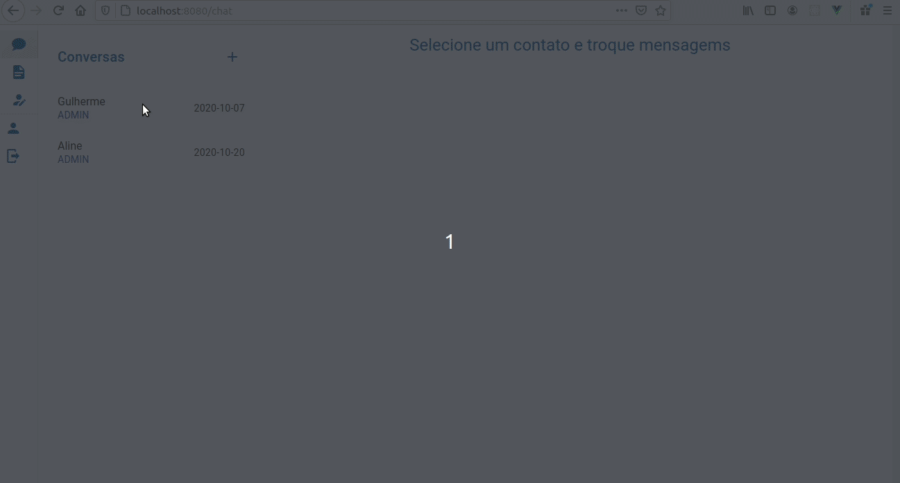

# Entrega 4 (01/11)

Nesta Sprint o foco foi no adição de gerencimento de estado e sessão no Aplicativo e na aplicação web.
Para gerenciamento de estado e sessão usou-se Vuex, na aplicação web e Redux, na aplicativo.
Além diso, adicionou-se conexão dos clientes(aplicativo e web) com o servidor REST e adicionou-se mensagem para tratamento de erros.
No back-end houve mapeamente de novos JSonView, adição de novas rotas e alteração de algumas rotas já existentes.

**Todas as implementações dessa sprint estão disponiveis na branch Sprint4**

## Backend
- Adição de rota get /atividades/:idUsuario (lista todas as atividades de um usuário)
- Adição de jsonview para atividades, arquivos, conversa
- Adição de rota get /usuario/:cpf (encontra um usuário por cpf)
- Atualização da rota de login para retorna idDoUsuario

## Front end

- Adição de Vuex
    - Adição de VuexPersist
    - Criação de state
    - Criação de mutations
    - Criação de getters
    - Criação de actions
- Conexão de Cliente e Servidor
    - Adição de axios
    - Adição de interceptors para tratamento de erros da requisiçã
    - Consumo de endpoints
- Adição de tela de login

## App

- Adição de Redux
    - Criação de state
    - Criação de mutations
    - Criação de getters
    - Criação de actions
- Conexão de Cliente e Servidor
    - Adição de axios
    - Adição de interceptors para tratamento de erros da requisição
    - Consumo de endpoints
- Adição de tela de login

## Documentos

- <a href="https://docs.google.com/spreadsheets/d/16mgDgj2gxbPdqgX_0csLu4ifDJYMtauJzQvvVK3YVBc/edit?usp=sharing" target="_blank"> Catálogo de Serviços </a>
- <a href="https://drive.google.com/file/d/1zT7dB800m1suLshmIUus7sN-4wMql07t/view?usp=sharing" target="_blank"> Matriz RACI </a>
- <a href="https://drive.google.com/file/d/11PmN4R4sO1TUYm4vP38nIMbgdvGV2CEo/view?usp=sharing" target="_blank"> Plano de risco </a>
- <a href="https://drive.google.com/file/d/1-KZNpswUXxecjInfYivBJkKaWiRooEQM/view?usp=sharing" target="_blank"> Checklist </a>
- <a href="https://drive.google.com/file/d/1rw0w10HCWdkRMwbgi9ZvsCarC_JyRWBL/view?usp=sharing" target="_blank"> Matriz de comunicação </a>
- <a href="https://drive.google.com/file/d/14-lm5uqeSYihOUIuX0v5wkQlHiZiVkDw/view?usp=sharing" target="_blank"> Planejado X Realizado(tempo & custo) </a>

## Gifs
### Aplicação web
#### tela de login

#### tela de chat

#### tela de arquivos

#### tela de atividades

### App

## Próximos passos

- Implementação de websocket
- Início Implementação IA
- Início Chat flutuante
- Adição de botão para fechar atividades
- Adição de botão para ver atividades fechadas

## Ferramentas Utilizadas

- Java
- Sprint Boot
- Maven
- Junit
- Vue
- Vue Router
- Vuetify
- React native
- Expo