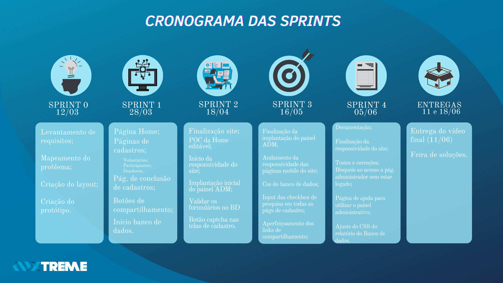
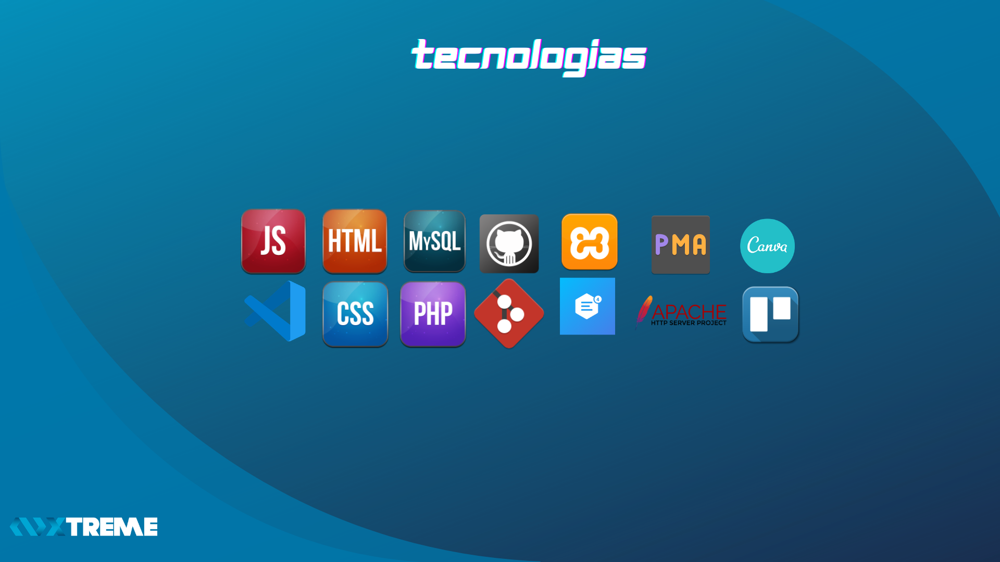
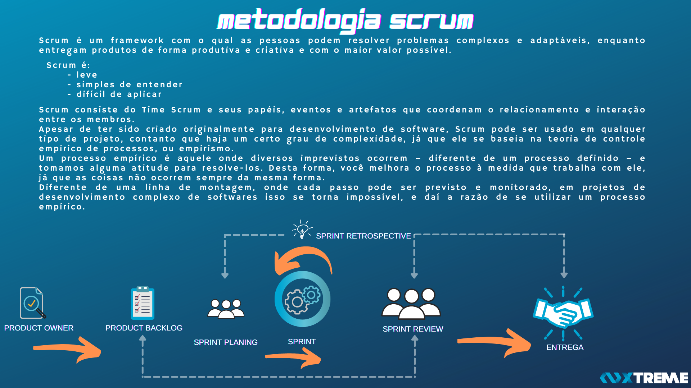
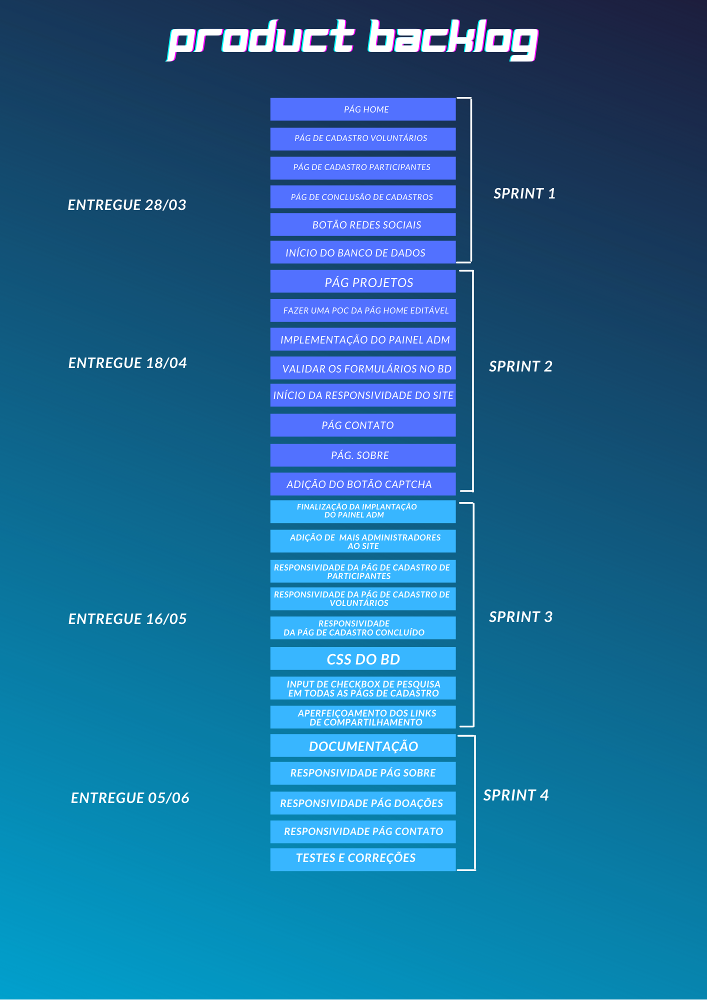
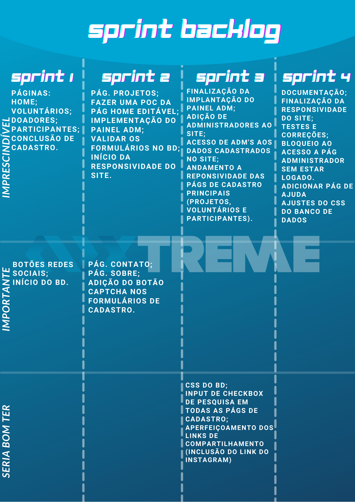

# Xtreme 

  <a href ="#o-projeto"> Projeto </a>  • 
  <a href ="#dart-proposta"> Proposta </a>  • 
  <a href ="#calendar-cronograma-das-sprints"> Sprints </a>  • 
  <a href ="#computer-tecnologias-utilizadas"> Tecnologias </a>  • 
  <a href ="#bulb-metodologia-utilizada"> Metodologia </a>  • 
  <a href ="#product-backlog">Product Backlog </a>  •
    <a href ="#sprints-backlog">Sprints Backlog </a>  •
  <a href ="#equipe"> Equipe </a> 

 

## O Projeto

 

> Status do Projeto: Em andamento 

 

## :dart: Proposta

**Desenvolver um site institucional com os seguintes requisitos:**  

 > **Requisitos**

 -  Cadastro de voluntários;
 -  Cadastro de projetos;
 -  Cadastro de doadores;
 -  Cadastro de participantes;
 -  Painel adminitrativo para alterações no site.  

 > **Funcionalidades extras**

 -   Link de compartilhamento do site nas redes sociais do visitante;
 -   Adaptação do site para versão mobile;
 -   Pesquisa de origem de tráfego.  

  
**:link: Clique no link abaixo para visualizar o modelo do site no Marvel.**  
> [Protótipo do Site](https://marvelapp.com/prototype/144cf1c4/screen/77188628)

 

## :calendar: Cronograma das Sprints

-  [SPRINT 0](https://github.com/Xtreme-Equipe/Projeto-Site-Intitucional/tree/main/readme/sprint0) - 28/02/2021 a 06/03/2021 

-  [SPRINT 1](https://github.com/Xtreme-Equipe/Projeto-Site-Intitucional/tree/main/readme/sprint1) - 08/03/2021 a 28/03/2021 

-  [SPRINT 2](https://github.com/Xtreme-Equipe/Projeto-Site-Intitucional/tree/main/readme/sprint2) - 29/03/2021 a 18/04/2021

-  [SPRINT 3](https://github.com/Xtreme-Equipe/Projeto-Site-Intitucional/tree/main/readme/sprint3) - 26/04/2021 a 16/05/2021

-  [SPRINT 4](https://github.com/Xtreme-Equipe/Projeto-Site-Intitucional/tree/main/readme/sprint4) - 17/05/2021 a 05/06/2021

-  Apresentação Final - 06/06/2021 a 11/06/2021

-  Feira de Soluções - 14/06/2021 a 18/06/2021

<h1 align="center"> </h1>

 

## :computer: Tecnologias Utilizadas

<h1 align="center"> </h1>

* **Banco de Dados:** MySQL;
* **Back-end:** PhP, Apache;
* **Front-end:** HTML, CSS, JavaScript;
* **Ferramentas:** Visual Studio Code, phpMyAdmin, Miro, Canva, Trello, CkEditor, Git e Github;

 

## :bulb: Metodologia Utilizada

* **Metodologia Ágil: SCRUM** 
 </h1> 

 

## Product Backlog

<h1 align="center"> </h1> 

 

## Sprints Backlog 

<h1 align="center"> </h1> 

 

## Equipe 

 

|Nome|Função|Linkedin|GitHub|Avatar|
| -------- |-------- |-------- |-------- |-------- |
|**Taís Salomão**|Scrum Master|[@LinkedIn](https://www.linkedin.com/in/tais-salomao/)|[@GitHub](https://github.com/taissalomao)||
|**Carlos Henrique**|Desenvolvedor |[@LinkedIn](https://www.linkedin.com/in/carlos-henrique-2788a0206/)|[@GitHub](https://github.com/carlosleitiii)||
|**Élen Petri**|Desenvolvedor|[@LinkedIn](https://www.linkedin.com/in/elen-petri/)|[@GitHub](https://github.com/elenpetri)| |
|**Julio Cesar**|Desenvolvedor|[@LinkedIn](https://www.linkedin.com/in/juliocesar-07b55a139/)|[@GitHub](https://github.com/juliocesar1316)||
|**Leandro Massafera**|Desenvolvedor|[@LinkedIn](https://www.linkedin.com/in/leandro-massafera/)|[@GitHub](https://github.com/LEANDROMASSAFERA)||
|**Rodrigo de Andrade**|Desenvolvedor|[@LinkedIn](https://www.linkedin.com/in/rodrigo-de-andrade-a34605104/)|[@GitHub](https://github.com/RodrigodeAndrade90)| |
|**Vinicios Almeida**|Desenvolvedor|[@LinkedIn](https://www.linkedin.com/in/vin%C3%ADcios-almeida-46800a206/)|[@GitHub](https://github.com/ViniciosAlmeida)||

 
