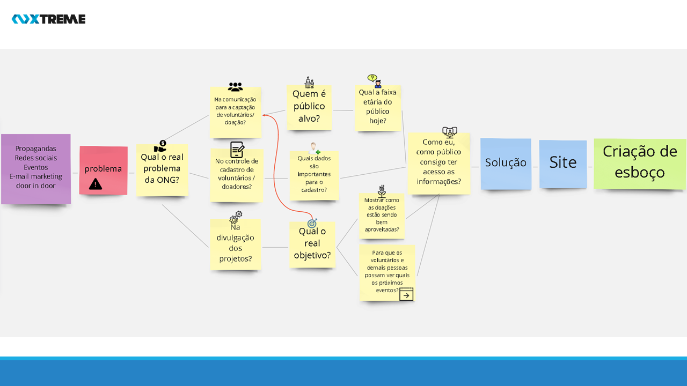
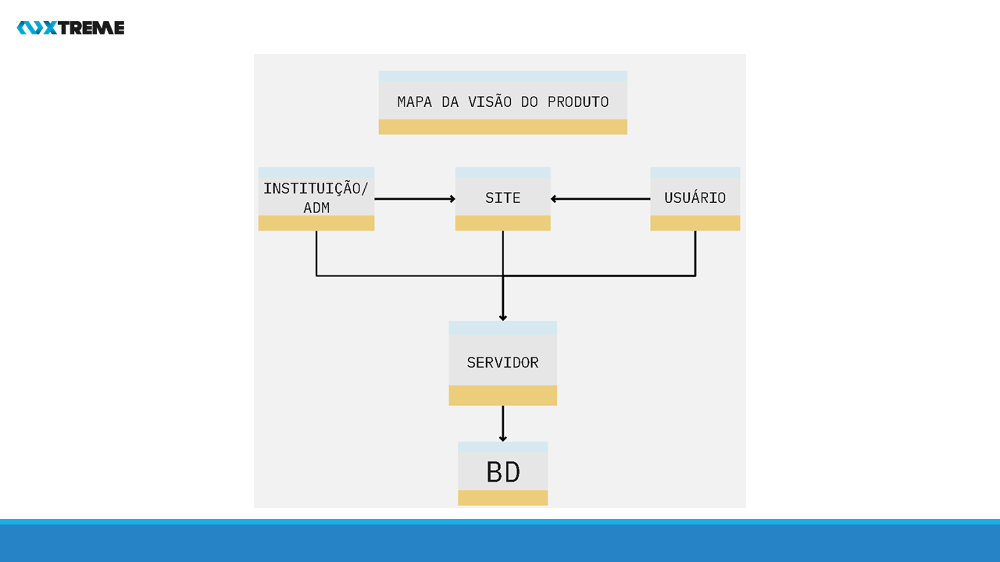
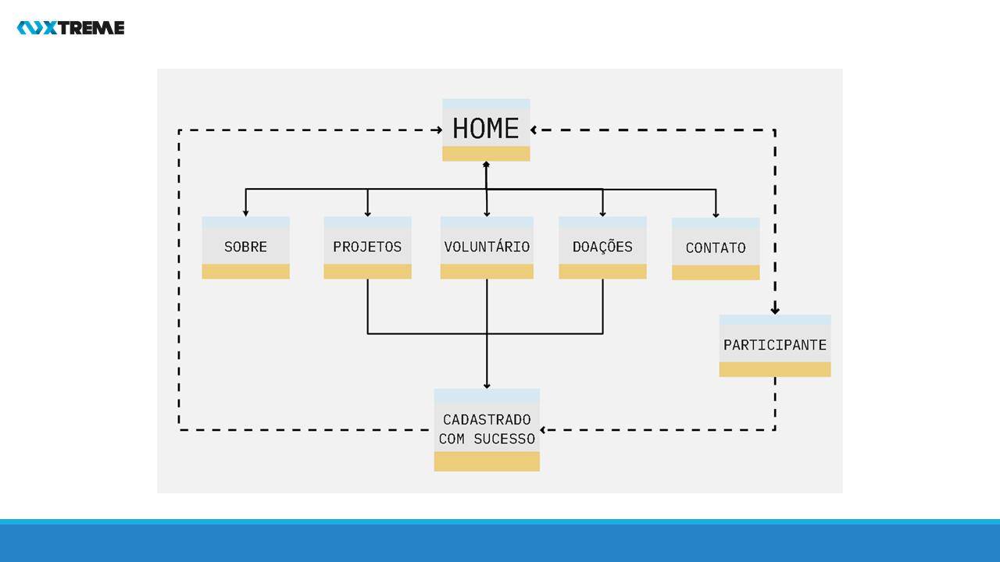

# Xtreme 

## :ballot_box_with_check: SPRINT 0

Na semana do 5 days sprint, fizemos o levantamento e análise do problema do cliente até chegarmos na solução, onde decidimos desenvolver um site institucinal a fim de aumentar sua visibilidade como um todo.

 

**Clique no link abaixo para visualizar o modelo do site no Marvel.**  
> [Protótipo do Site](https://marvelapp.com/prototype/144cf1c4/screen/77188628)

 

## Mapa do Problema

<h1 align="center"> </h1>

 

## Visão do produto 

<h1 align="center"> </h1>
 

## Diagrama do site 

<h1 align="center"> </h1>

> Para ter uma visão completa acesse: [Mapa do site](../sprint0/mapa_do_site.pdf)

 

## :desktop_computer: Layout protótipo

<h3 align="center">Home</h3>

<h1 align="center"> </h1>

 

<h3 align="center">Menu</h3>

<h1 align="center"> </h1>

 

<h3 align="center">Cadastro com sucesso</h3>

<h1 align="center"> </h1>

 