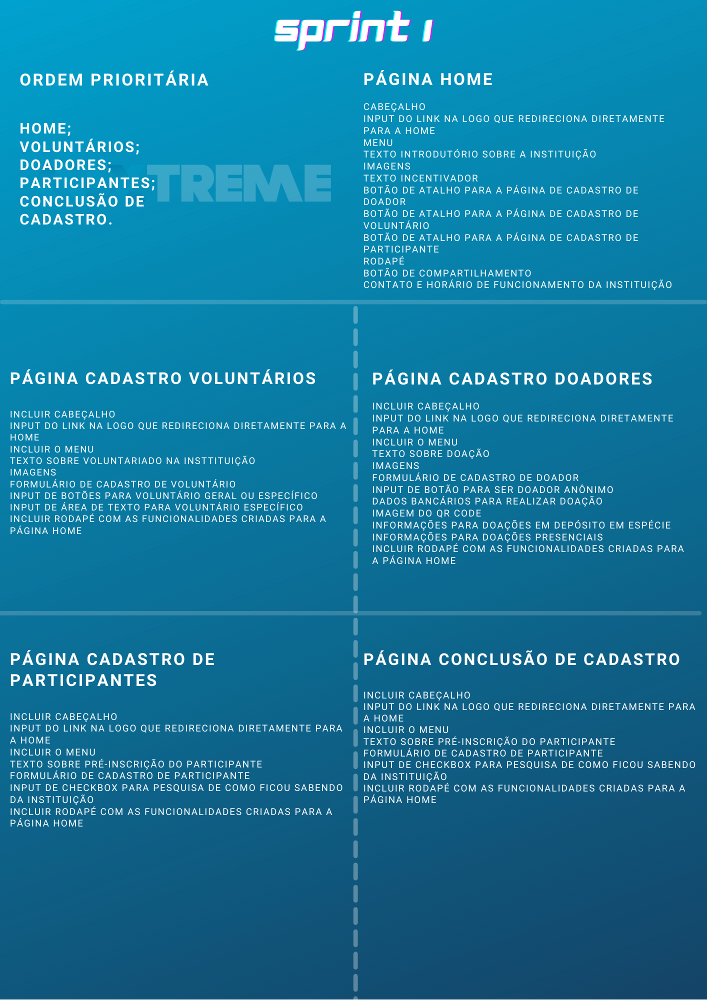
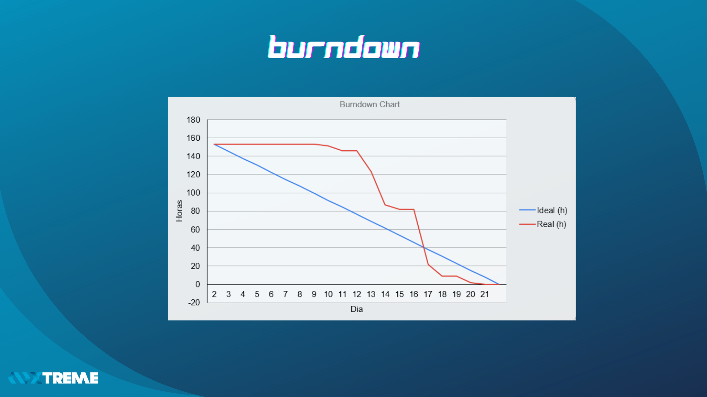
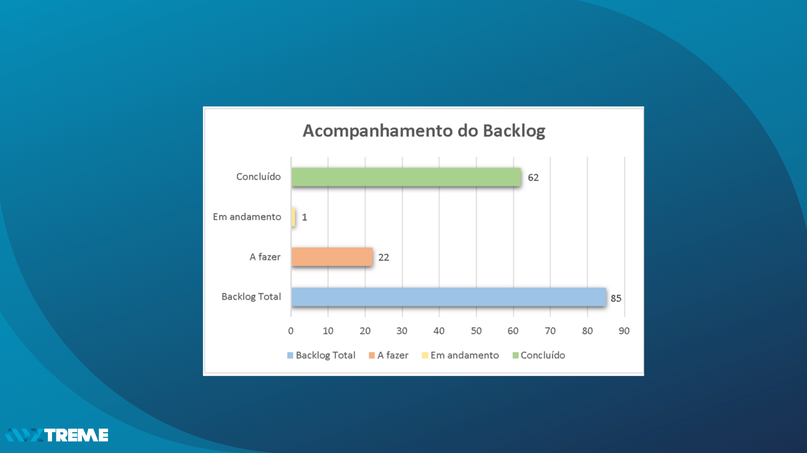
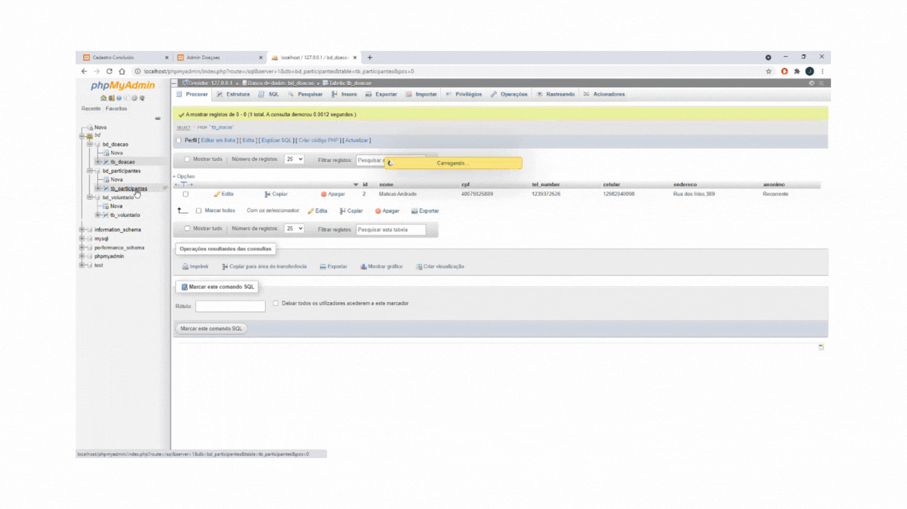

# Xtreme 

## :ballot_box_with_check: SPRINT 1

Após o cliente aprovar o protótipo apresentado, o desenvolvimento do projeto se baseou em focar no principal objetivo do site, que é atrair mais visibilidade para a ONG, desenvolvendo a principio as principais telas que são: home, cadastro de participantes, cadastro de doador e cadastro de voluntários (sendo ele específico ou não).

 

## Sprint Backlog 

<h1 align="center"> </h1>
 

## Burndown da Sprint

<h1 align="center"> </h1>

##  Gráfico do Backlog

<h1 align="center"> </h1>

 

## :desktop_computer: Funcionalidades da Sprint

<h3 align="center">Home</h3>

<h1 align="center"> </h1>

 

<h3 align="center">Cadastro Voluntários</h3>

<h1 align="center"> </h1>

 

<h3 align="center">Cadastro Doador</h3>

<h1 align="center"> </h1>

 

<h3 align="center">Cadastro Participantes</h3>

<h1 align="center"> </h1>

 

<h3 align="center">Cadastro com sucesso</h3>

<h1 align="center"> </h1>

 

<h3 align="center">Banco de dados</h3>

<h1 align="center"> </h1>

 

<h3 align="center">Compartilhamento do site</h3>

<h1 align="center"> </h1>

 