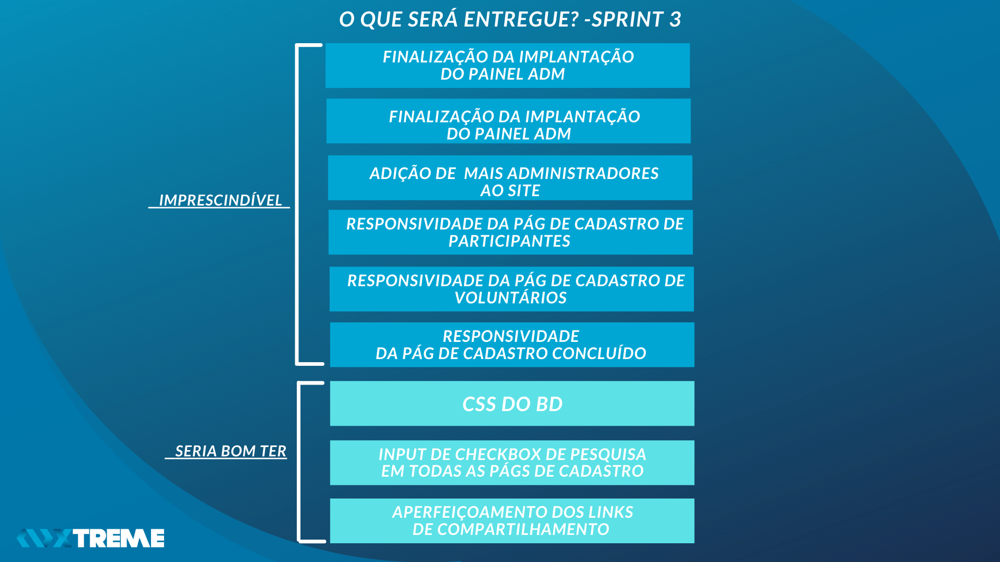
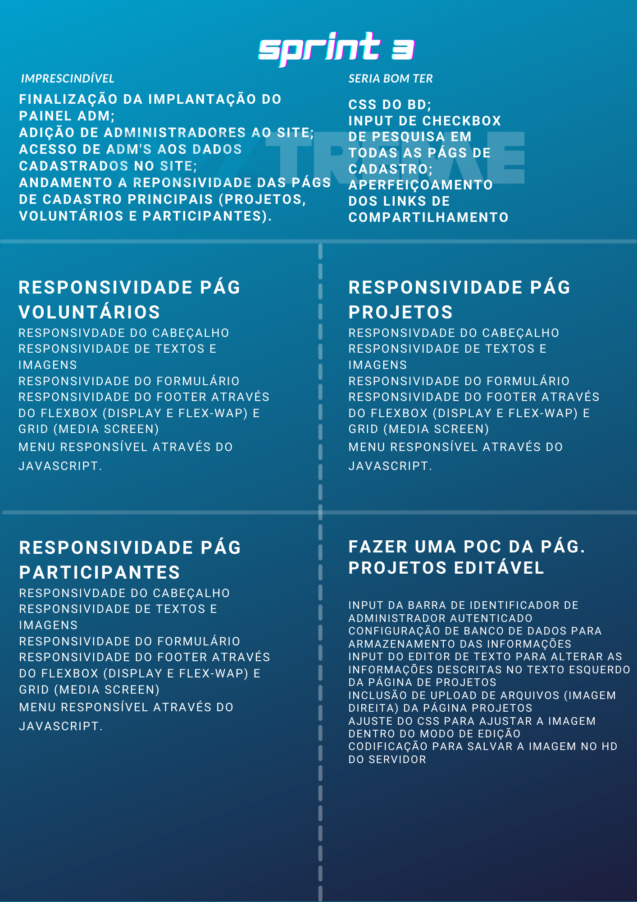
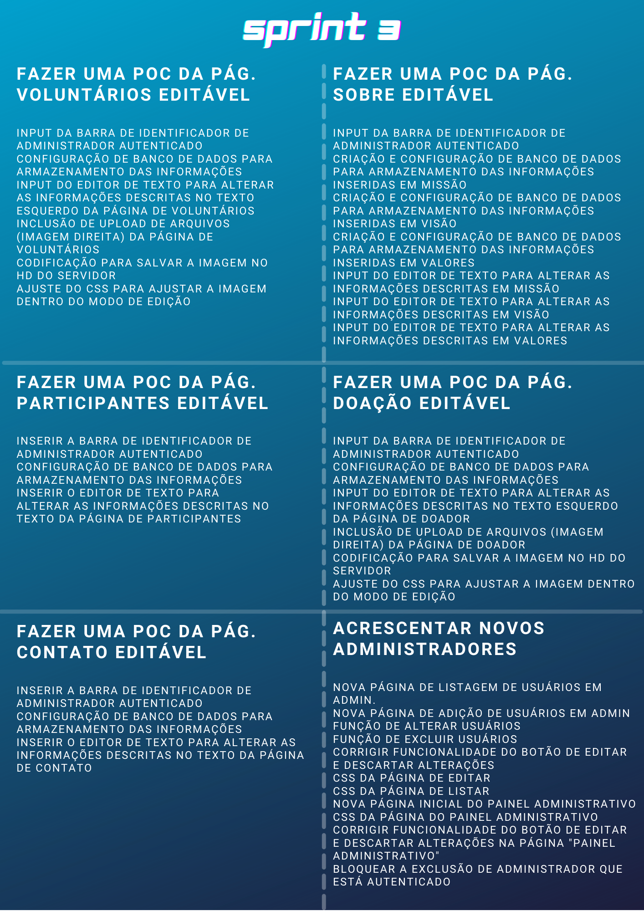
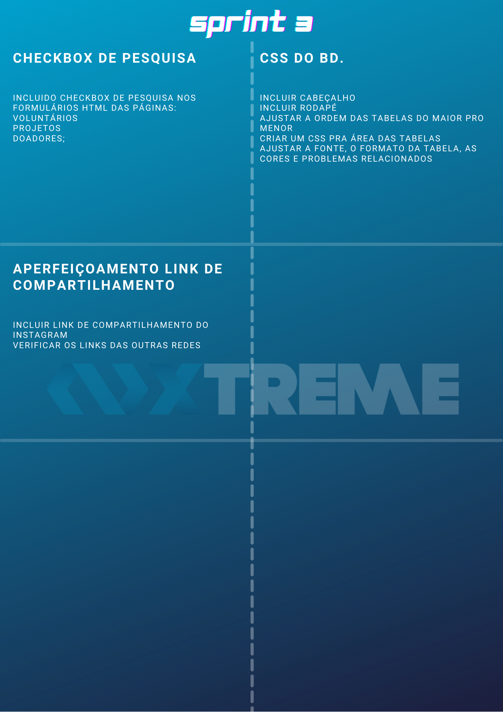
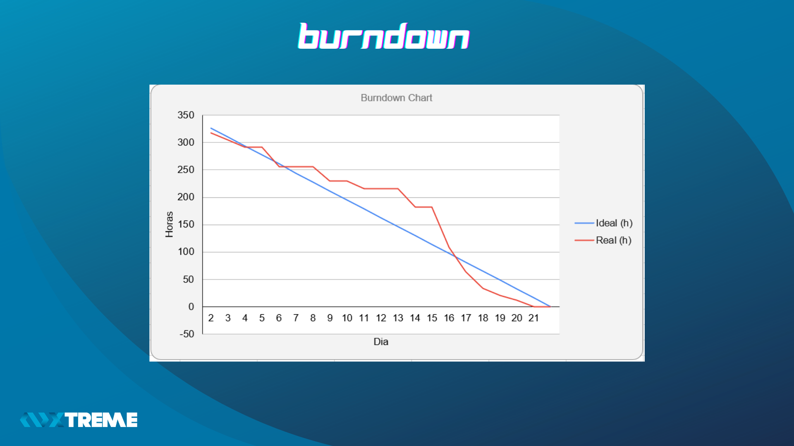
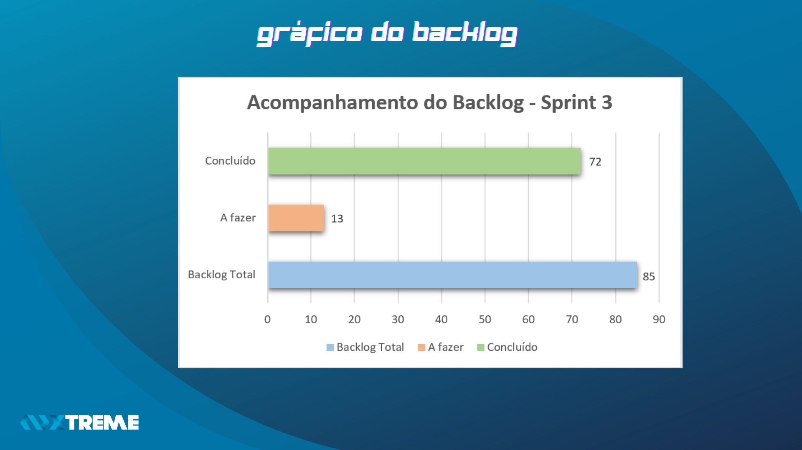
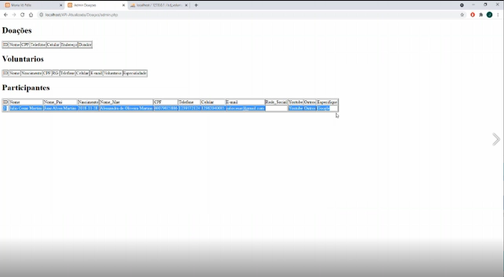

# Xtreme 

## :ballot_box_with_check: SPRINT 3

Nesta Sprint, com o site finalizado, demos ênfase ao painel administrativo, tornando todas as páginas editáveis, inserindo função de adicionar mais administradores ao site e criando uma tela de início ao painel, onde o usuário poderá navegar facilmente entre as funcionalidades de administrador. Demos continuidade a responsividade mobile do site, focando essencialmente nas páginas que foram requisitadas pelo cliente desde o princípio que são: Cadastro de voluntários, cadastro de participantes e cadastro de projetos.
 

## Sprint Backlog 

<h1 align="center"> </h1>
 

<h1 align="center"> </h1>
 
<h1 align="center"> </h1>
 
<h1 align="center"> </h1>
 

## Burndown da Sprint

<h1 align="center"> </h1>

## Gráfico do Backlog

<h1 align="center"> </h1>

 

## :desktop_computer: Funcionalidades da Sprint

<h3 align="center">Página Sobre Editável</h3>

<h1 align="center"> </h1>

 

<h3 align="center">Página Projetos Editável</h3>

<h1 align="center"> </h1>

 

<h3 align="center">Página Voluntários Editável</h3>

<h1 align="center"> </h1>

 

<h3 align="center">Página Contato Editável</h3>

<h1 align="center"> </h1>

 
<h3 align="center">Página Doações Editável</h3>

<h1 align="center"> </h1>

 

<h3 align="center">Página Participantes Editável</h3>

<h1 align="center"> </h1>

 
<h3 align="center">Adicionando Administradores ao site</h3>

<h1 align="center"> </h1>
 

<h3 align="center">Funcionalidades botões tela de início Painel Administrativo</h3>

<h1 align="center"> </h1>

 
<h3 align="center">Página Projetos Mobile</h3>

<h1 align="center"> </h1>

 
<h3 align="center">Página Voluntários Mobile</h3>

<h1 align="center"> </h1>

 

<h3 align="center">Página Participantes Mobile</h3>

<h1 align="center"> </h1>

 
 

<h3 align="center">Compartilhamento do site</h3>

<h1 align="center"> </h1>

 
 

<h3 align="center">CSS "Banco de Dados"</h3>

Tabelas de cadastro do banco de dados sem estilização.

Tabelas de cadastro do banco de dados estilizado.

<h1 align="center"> </h1>

 

